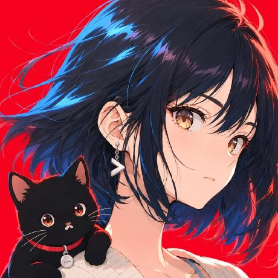
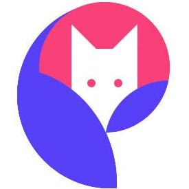
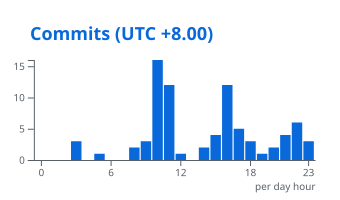
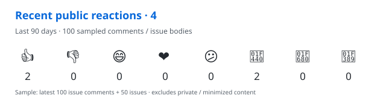

<div align="center">

# Dante / Agent Workbench

<p><samp>TypeScript · AI agents · Open source</samp></p>

<samp>
  <a href="https://dhpie.com">blog</a> ·
  <a href="https://github.com/Dante-dan?tab=repositories">code</a> ·
  <a href="https://github.com/search?q=is%3Apr+author%3ADante-dan&type=pullrequests">contributions</a> ·
  <a href="mailto:duanjl.china@gmail.com">contact</a>
</samp>

</div>

```text
$ whoami
Dante · developer · China

$ cat workflow.txt
question → investigate → build
verify → contribute → write
```

I build with TypeScript and AI agents. I investigate issues, work on fixes,
and contribute to the design discussions behind the tools I use.
I write about the process on [dhpie.com](https://dhpie.com).

### `~/workbench`

<sub>Recently pushed public projects · forks excluded</sub>

<!-- workbench:start -->
- **[langgraph-learning-lab](https://github.com/Dante-dan/langgraph-learning-lab)** — Interactive Chinese LangGraph learning lab with Python/TypeScript examples and a visual execution playground
- **[pi-agent-learning-lab](https://github.com/Dante-dan/pi-agent-learning-lab)** — Interactive Chinese learning lab for Pi Agent extensions, SDK, tools, sessions, providers, and production patterns
- **[dan-skills](https://github.com/Dante-dan/dan-skills)** — Public TypeScript project.
<!-- workbench:end -->

### `~/contributions`

<!-- contributions:start -->
<sub>Code accepted upstream · last 12 months</sub>

<table align="left" width="270"><tr><td width="64" valign="middle"><a href="https://github.com/affaan-m/ECC"></a></td><td width="200" valign="middle"><a href="https://github.com/affaan-m/ECC"><strong>ECC</strong></a><br /><sub><a href="https://github.com/affaan-m/ECC/commit/d3af582bade744680d9c3114c7dd7850f98b4474">integrated contribution</a><br /><a href="https://github.com/affaan-m/ECC/pulls?q=is%3Apr+author%3ADante-dan">all PRs ↗</a></sub></td></tr></table>
<table align="left" width="270"><tr><td width="64" valign="middle"><a href="https://github.com/makecindy/cindy"></a></td><td width="200" valign="middle"><a href="https://github.com/makecindy/cindy"><strong>Cindy</strong></a><br /><sub><a href="https://github.com/makecindy/cindy/pull/4219">merged contribution</a><br /><a href="https://github.com/makecindy/cindy/pulls?q=is%3Apr+author%3ADante-dan">all PRs ↗</a></sub></td></tr></table>
<table align="left" width="270"><tr><td width="64" valign="middle"><a href="https://github.com/CherryHQ/cherry-studio"></a></td><td width="200" valign="middle"><a href="https://github.com/CherryHQ/cherry-studio"><strong>Cherry Studio</strong></a><br /><sub><a href="https://github.com/CherryHQ/cherry-studio/pull/20267">merged contribution</a><br /><a href="https://github.com/CherryHQ/cherry-studio/pulls?q=is%3Apr+author%3ADante-dan">all PRs ↗</a></sub></td></tr></table>
<br clear="all" />

<details>
<summary>Earlier contributions</summary>

<table align="left" width="270"><tr><td width="64" valign="middle"><a href="https://github.com/cpsoinos/nuxt-svgo"></a></td><td width="200" valign="middle"><a href="https://github.com/cpsoinos/nuxt-svgo"><strong>nuxt-svgo</strong></a><br /><sub><a href="https://github.com/cpsoinos/nuxt-svgo/pull/201">merged contribution</a><br /><a href="https://github.com/cpsoinos/nuxt-svgo/pulls?q=is%3Apr+author%3ADante-dan">all PRs ↗</a></sub></td></tr></table>
<table align="left" width="270"><tr><td width="64" valign="middle"><a href="https://github.com/GoogleChromeLabs/uach-retrofill"></a></td><td width="200" valign="middle"><a href="https://github.com/GoogleChromeLabs/uach-retrofill"><strong>uach-retrofill</strong></a><br /><sub><a href="https://github.com/GoogleChromeLabs/uach-retrofill/pull/43">merged contribution</a><br /><a href="https://github.com/GoogleChromeLabs/uach-retrofill/pulls?q=is%3Apr+author%3ADante-dan">all PRs ↗</a></sub></td></tr></table>
<table align="left" width="270"><tr><td width="64" valign="middle"><a href="https://github.com/frejs/fre"></a></td><td width="200" valign="middle"><a href="https://github.com/frejs/fre"><strong>fre</strong></a><br /><sub><a href="https://github.com/frejs/fre/pull/264">merged contribution</a><br /><a href="https://github.com/frejs/fre/pulls?q=is%3Apr+author%3ADante-dan">all PRs ↗</a></sub></td></tr></table>
<table align="left" width="270"><tr><td width="64" valign="middle"><a href="https://github.com/youzan/vant"></a></td><td width="200" valign="middle"><a href="https://github.com/youzan/vant"><strong>Vant</strong></a><br /><sub><a href="https://github.com/youzan/vant/pull/8387">merged contribution</a><br /><a href="https://github.com/youzan/vant/pulls?q=is%3Apr+author%3ADante-dan">all PRs ↗</a></sub></td></tr></table>
<br clear="all" />

</details>
<!-- contributions:end -->

### `~/upstream`

<sub>Public upstream PRs updated in the last 14 days · refreshed daily</sub>

<!-- upstream:start -->
<sub>27 PRs · 18 open · 6 merged · 1 integrated · 2 closed</sub>

| Status | Pull request | Updated (UTC) |
| :--- | :--- | :--- |
| `merged` | **[apache/maka#5188](https://github.com/apache/maka/pull/5188)** — fix(runtime-host): respect transcript continuation boundaries | 2026-09-11 |
| `merged` | **[CherryHQ/cherry-studio#20319](https://github.com/CherryHQ/cherry-studio/pull/20319)** — fix(quick-assistant): preserve dark surface on Windows | 2026-09-11 |
| `open` | **[LodyAI/Lody#563](https://github.com/LodyAI/Lody/pull/563)** — fix(cli): coalesce overlapping history refreshes | 2026-09-11 |
| `open` | **[LodyAI/acp-extension-dsh#15](https://github.com/LodyAI/acp-extension-dsh/pull/15)** — feat: support provider-qualified DSH routes | 2026-09-11 |
| `open` | **[multica-ai/multica#8297](https://github.com/multica-ai/multica/pull/8297)** — MUL-7275: fix(skills): normalize Windows archive entry paths | 2026-09-11 |
| `open` | **[CherryHQ/cherry-studio#20378](https://github.com/CherryHQ/cherry-studio/pull/20378)** — feat(knowledge): accept all recognized text files | 2026-09-11 |
| `open` | **[LodyAI/Lody#577](https://github.com/LodyAI/Lody/pull/577)** — fix: wait for metadata before archive cascade | 2026-09-11 |
| `open` | **[CherryHQ/cherry-studio#20353](https://github.com/CherryHQ/cherry-studio/pull/20353)** — fix(ai-runtime): clamp agent output token limit | 2026-09-11 |
| `open` | **[makecindy/cindy#4297](https://github.com/makecindy/cindy/pull/4297)** — fix(desktop): render automation settings before status probes | 2026-09-11 |
| `open` | **[CherryHQ/cherry-studio#20386](https://github.com/CherryHQ/cherry-studio/pull/20386)** — fix(new-api): restore Gemini web search through relays | 2026-09-11 |
| `open` | **[CherryHQ/cherry-studio#20322](https://github.com/CherryHQ/cherry-studio/pull/20322)** — fix(agent): honor configured Pi shell path | 2026-09-11 |
| `open` | **[LodyAI/Lody#594](https://github.com/LodyAI/Lody/pull/594)** — fix(electron): declare OSS macOS local network usage | 2026-09-11 |
| `open` | **[affaan-m/ECC#3076](https://github.com/affaan-m/ECC/pull/3076)** — fix(hooks): support Windows linter paths and ESLint 9 | 2026-09-11 |
| `open` | **[LodyAI/Lody#587](https://github.com/LodyAI/Lody/pull/587)** — fix(cli): list remote machine projects without daemon | 2026-09-10 |
| `integrated` | **[affaan-m/ECC#3044](https://github.com/affaan-m/ECC/pull/3044)** — fix(install): handle missing Windows settings device IDs safely | 2026-09-10 |
| `open` | **[browser-use/browser-use#5771](https://github.com/browser-use/browser-use/pull/5771)** — fix(browser): clean up local browser process trees | 2026-09-10 |
| `merged` | **[makecindy/cindy#4219](https://github.com/makecindy/cindy/pull/4219)** — fix(mobile): open managed Markdown video links | 2026-09-10 |
| `open` | **[CherryHQ/cherry-studio#20349](https://github.com/CherryHQ/cherry-studio/pull/20349)** — fix(data-api): avoid overlapping timed-out reads | 2026-09-10 |
| `open` | **[CherryHQ/cherry-studio#20323](https://github.com/CherryHQ/cherry-studio/pull/20323)** — fix: accept sparse OpenAI response lifecycle events | 2026-09-10 |
| `merged` | **[makecindy/cindy#4185](https://github.com/makecindy/cindy/pull/4185)** — test(pi): wait for follow-up command observation | 2026-09-10 |
| `open` | **[CherryHQ/cherry-studio#20321](https://github.com/CherryHQ/cherry-studio/pull/20321)** — fix(chat-errors): normalize non-error throws | 2026-09-10 |
| `open` | **[CherryHQ/cherry-studio#20320](https://github.com/CherryHQ/cherry-studio/pull/20320)** — fix(work): keep pinned tasks in agent grouping | 2026-09-10 |
| `closed` | **[LodyAI/Lody#564](https://github.com/LodyAI/Lody/pull/564)** — feat: refresh subscription quota before sessions | 2026-09-10 |
| `open` | **[CherryHQ/cherry-studio#20281](https://github.com/CherryHQ/cherry-studio/pull/20281)** — fix(ai-core): repair restored tool result names | 2026-09-09 |
| `merged` | **[makecindy/cindy#4173](https://github.com/makecindy/cindy/pull/4173)** — fix(auth): wait for owner transition before login initialization | 2026-09-09 |
| `merged` | **[CherryHQ/cherry-studio#20267](https://github.com/CherryHQ/cherry-studio/pull/20267)** — fix(pi): preserve OpenCode session headers | 2026-09-09 |
| `closed` | **[earendil-works/pi#8908](https://github.com/earendil-works/pi/pull/8908)** — fix(coding-agent): preserve compaction queued prompts | 2026-08-31 |
<!-- upstream:end -->

<details>
<summary>Recent conversations · issues, comments &amp; reviews</summary>

<!-- activity:start -->
- `2026-09-11` Commented on **[CherryHQ/cherry-studio#20378](https://github.com/CherryHQ/cherry-studio/pull/20378#issuecomment-5631400699)** — feat(knowledge): accept all recognized text files
- `2026-09-11` Commented on **[apache/maka#5182](https://github.com/apache/maka/issues/5182#issuecomment-5630424254)** — feat(desktop): move a Session between Maka installations from the app
- `2026-09-11` Commented on **[LodyAI/Lody#594](https://github.com/LodyAI/Lody/pull/594#discussion_r3986483704)**
- `2026-09-11` Commented on **[apache/maka#5183](https://github.com/apache/maka/issues/5183#issuecomment-5630353494)** — bug(runtime-host): a transcript page that spans a Turn boundary can exceed the client&#x27;s 256-message…
<!-- activity:end -->

</details>

[More contributions →](https://github.com/search?q=is%3Apr+author%3ADante-dan&type=pullrequests)

### `~/notes`

<sub>Latest writing from [dhpie.com](https://dhpie.com)</sub>

<!-- notes:start -->
- [开源贡献日报 · 2026-09-10](https://dhpie.com/posts/cn/open-source-daily-2026-09-10)
- [开源贡献日报 · 2026-09-09](https://dhpie.com/posts/cn/open-source-daily-2026-09-09)
- [买车买出来的一条投资逻辑：电车的钱不在卖车](https://dhpie.com/posts/cn/mai-che-mai-chu-lai-de-yi-tiao-tou-zi-luo-ji)
- [整理梁文锋投资者交流会的一些内容](https://dhpie.com/notes/29)
<!-- notes:end -->

### `~/telemetry`

<picture>
  <source media="(prefers-color-scheme: dark)" srcset="assets/stats-dark.svg" />
  
</picture>
<picture>
  <source media="(prefers-color-scheme: dark)" srcset="assets/time-dark.svg" />
  
</picture>




### `~/arcade`

<picture>
  <source media="(prefers-color-scheme: dark)" srcset="https://raw.githubusercontent.com/Dante-dan/Dante-dan/output/bomberman-contribution-graph-dark.svg" />
  
</picture>

<sub>Bomberman · powered by <a href="https://github.com/abozanona/pacman-contribution-graph">Arcade Contribution Graph</a></sub>

---

<sub>Refreshed daily with GitHub Actions · [Workflow](.github/workflows/profile.yml) · [Blog](https://dhpie.com)</sub>
