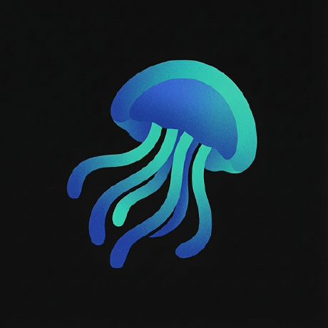
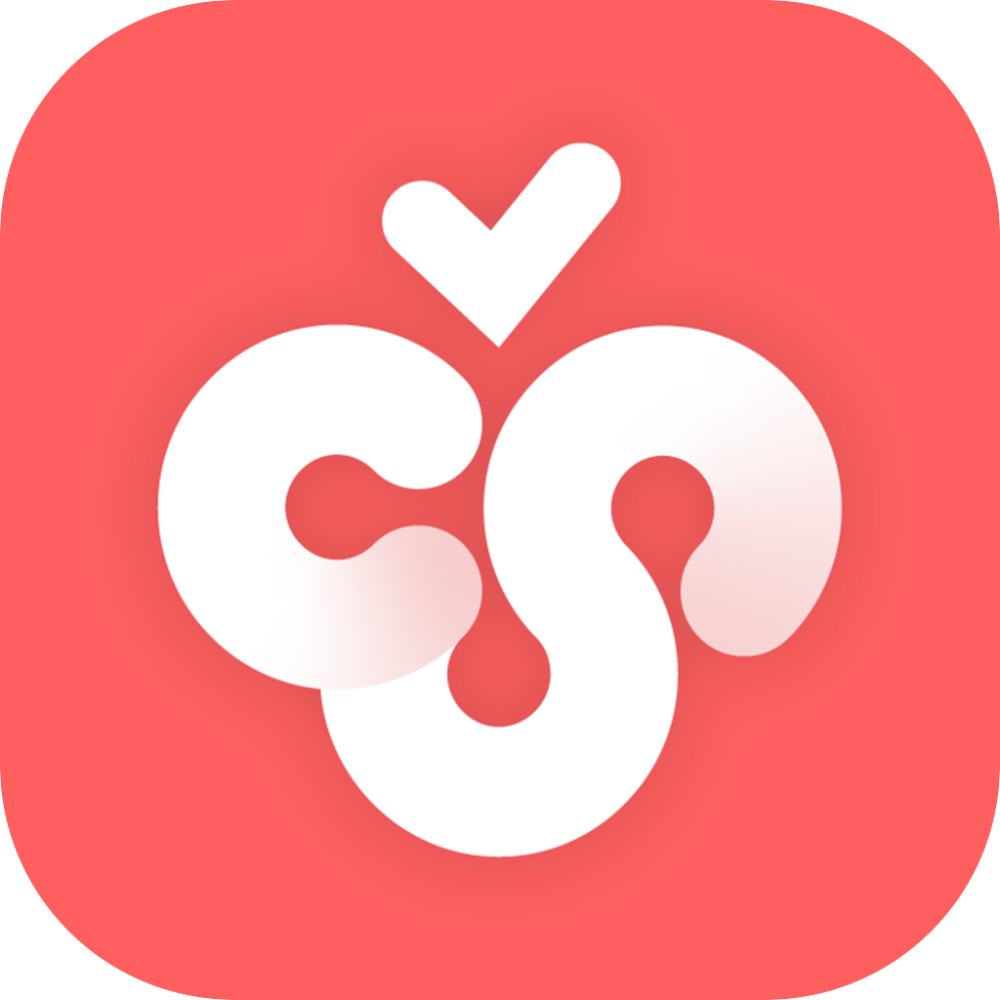
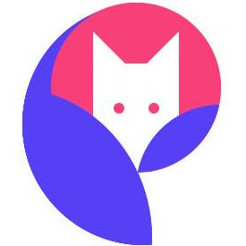
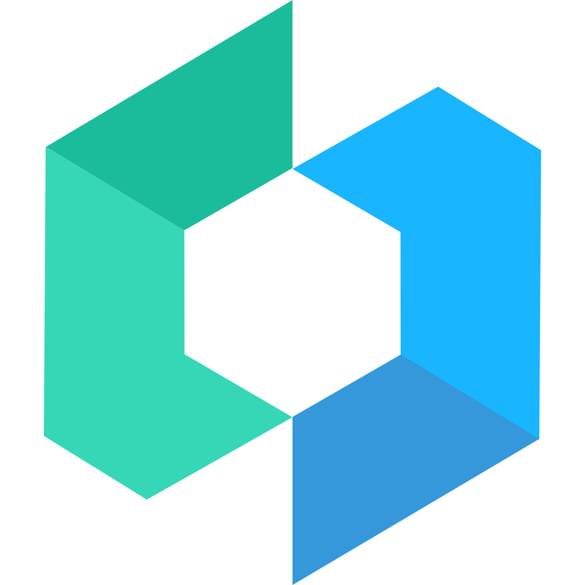

<div align="center">

# Dante / Agent Workbench

<p><samp>TypeScript · AI agents · Open source</samp></p>

<samp>
  <a href="https://dhpie.com">blog</a> ·
  <a href="https://github.com/Dante-dan?tab=repositories">code</a> ·
  <a href="https://github.com/search?q=is%3Apr+author%3ADante-dan&type=pullrequests">contributions</a> ·
  <a href="mailto:duanjl.china@gmail.com">contact</a>
</samp>

</div>

```text
$ whoami
Dante · developer · China

$ cat workflow.txt
question → investigate → build
verify → contribute → write
```

I build with TypeScript and AI agents. I investigate issues, work on fixes,
and contribute to the design discussions behind the tools I use.
I write about the process on [dhpie.com](https://dhpie.com).

[](https://ghfind.com/u/dante-dan?ref=badge)

### `~/workbench`

<sub>Recently pushed public projects · forks excluded</sub>

<!-- workbench:start -->
- **[pi-agent-book](https://github.com/Dante-dan/pi-agent-book)** — 《Pi Agent从入门到精通》：面向零基础的中文开源书，基于源码拆解上下文、记忆、工具、扩展与持续进化，附可复现实验。
- **[dan-skills](https://github.com/Dante-dan/dan-skills)** — Public TypeScript project.
- **[pi-agent-learning-lab](https://github.com/Dante-dan/pi-agent-learning-lab)** — Interactive Chinese learning lab for Pi Agent extensions, SDK, tools, sessions, providers, and production patterns
<!-- workbench:end -->

### `~/contributions`

<!-- contributions:start -->
<sub>Code accepted upstream · last 12 months</sub>

<table align="left" width="270"><tr><td width="64" valign="middle"><a href="https://github.com/code-yeongyu/oh-my-openagent"></a></td><td width="200" valign="middle"><a href="https://github.com/code-yeongyu/oh-my-openagent"><strong>oh-my-openagent</strong></a><br /><sub><a href="https://github.com/code-yeongyu/oh-my-openagent/pull/9233">merged contribution</a><br /><a href="https://github.com/code-yeongyu/oh-my-openagent/pulls?q=is%3Apr+author%3ADante-dan">all PRs ↗</a></sub></td></tr></table>
<table align="left" width="270"><tr><td width="64" valign="middle"><a href="https://github.com/LodyAI/acp-extension-dsh"></a></td><td width="200" valign="middle"><a href="https://github.com/LodyAI/acp-extension-dsh"><strong>acp-extension-dsh</strong></a><br /><sub><a href="https://github.com/LodyAI/acp-extension-dsh/pull/15">merged contribution</a><br /><a href="https://github.com/LodyAI/acp-extension-dsh/pulls?q=is%3Apr+author%3ADante-dan">all PRs ↗</a></sub></td></tr></table>
<table align="left" width="270"><tr><td width="64" valign="middle"><a href="https://github.com/affaan-m/ECC"></a></td><td width="200" valign="middle"><a href="https://github.com/affaan-m/ECC"><strong>ECC</strong></a><br /><sub><a href="https://github.com/affaan-m/ECC/pull/3213">merged contribution</a><br /><a href="https://github.com/affaan-m/ECC/pulls?q=is%3Apr+author%3ADante-dan">all PRs ↗</a></sub></td></tr></table>
<table align="left" width="270"><tr><td width="64" valign="middle"><a href="https://github.com/can1357/oh-my-pi"></a></td><td width="200" valign="middle"><a href="https://github.com/can1357/oh-my-pi"><strong>oh-my-pi</strong></a><br /><sub><a href="https://github.com/can1357/oh-my-pi/pull/13435">merged contribution</a><br /><a href="https://github.com/can1357/oh-my-pi/pulls?q=is%3Apr+author%3ADante-dan">all PRs ↗</a></sub></td></tr></table>
<table align="left" width="270"><tr><td width="64" valign="middle"><a href="https://github.com/LodyAI/Lody"></a></td><td width="200" valign="middle"><a href="https://github.com/LodyAI/Lody"><strong>Lody</strong></a><br /><sub><a href="https://github.com/LodyAI/Lody/pull/587">merged contribution</a><br /><a href="https://github.com/LodyAI/Lody/pulls?q=is%3Apr+author%3ADante-dan">all PRs ↗</a></sub></td></tr></table>
<table align="left" width="270"><tr><td width="64" valign="middle"><a href="https://github.com/CherryHQ/cherry-studio"></a></td><td width="200" valign="middle"><a href="https://github.com/CherryHQ/cherry-studio"><strong>Cherry Studio</strong></a><br /><sub><a href="https://github.com/CherryHQ/cherry-studio/pull/20950">merged contribution</a><br /><a href="https://github.com/CherryHQ/cherry-studio/pulls?q=is%3Apr+author%3ADante-dan">all PRs ↗</a></sub></td></tr></table>
<table align="left" width="270"><tr><td width="64" valign="middle"><a href="https://github.com/multica-ai/multica"></a></td><td width="200" valign="middle"><a href="https://github.com/multica-ai/multica"><strong>multica</strong></a><br /><sub><a href="https://github.com/multica-ai/multica/pull/8297">merged contribution</a><br /><a href="https://github.com/multica-ai/multica/pulls?q=is%3Apr+author%3ADante-dan">all PRs ↗</a></sub></td></tr></table>
<table align="left" width="270"><tr><td width="64" valign="middle"><a href="https://github.com/apache/maka"></a></td><td width="200" valign="middle"><a href="https://github.com/apache/maka"><strong>maka</strong></a><br /><sub><a href="https://github.com/apache/maka/pull/5226">merged contribution</a><br /><a href="https://github.com/apache/maka/pulls?q=is%3Apr+author%3ADante-dan">all PRs ↗</a></sub></td></tr></table>
<table align="left" width="270"><tr><td width="64" valign="middle"><a href="https://github.com/makecindy/cindy"></a></td><td width="200" valign="middle"><a href="https://github.com/makecindy/cindy"><strong>Cindy</strong></a><br /><sub><a href="https://github.com/makecindy/cindy/pull/4219">merged contribution</a><br /><a href="https://github.com/makecindy/cindy/pulls?q=is%3Apr+author%3ADante-dan">all PRs ↗</a></sub></td></tr></table>
<br clear="all" />

<details>
<summary>Earlier contributions</summary>

<table align="left" width="270"><tr><td width="64" valign="middle"><a href="https://github.com/cpsoinos/nuxt-svgo"></a></td><td width="200" valign="middle"><a href="https://github.com/cpsoinos/nuxt-svgo"><strong>nuxt-svgo</strong></a><br /><sub><a href="https://github.com/cpsoinos/nuxt-svgo/pull/201">merged contribution</a><br /><a href="https://github.com/cpsoinos/nuxt-svgo/pulls?q=is%3Apr+author%3ADante-dan">all PRs ↗</a></sub></td></tr></table>
<table align="left" width="270"><tr><td width="64" valign="middle"><a href="https://github.com/GoogleChromeLabs/uach-retrofill"></a></td><td width="200" valign="middle"><a href="https://github.com/GoogleChromeLabs/uach-retrofill"><strong>uach-retrofill</strong></a><br /><sub><a href="https://github.com/GoogleChromeLabs/uach-retrofill/pull/43">merged contribution</a><br /><a href="https://github.com/GoogleChromeLabs/uach-retrofill/pulls?q=is%3Apr+author%3ADante-dan">all PRs ↗</a></sub></td></tr></table>
<table align="left" width="270"><tr><td width="64" valign="middle"><a href="https://github.com/frejs/fre"></a></td><td width="200" valign="middle"><a href="https://github.com/frejs/fre"><strong>fre</strong></a><br /><sub><a href="https://github.com/frejs/fre/pull/264">merged contribution</a><br /><a href="https://github.com/frejs/fre/pulls?q=is%3Apr+author%3ADante-dan">all PRs ↗</a></sub></td></tr></table>
<table align="left" width="270"><tr><td width="64" valign="middle"><a href="https://github.com/youzan/vant"></a></td><td width="200" valign="middle"><a href="https://github.com/youzan/vant"><strong>Vant</strong></a><br /><sub><a href="https://github.com/youzan/vant/pull/8387">merged contribution</a><br /><a href="https://github.com/youzan/vant/pulls?q=is%3Apr+author%3ADante-dan">all PRs ↗</a></sub></td></tr></table>
<br clear="all" />

</details>
<!-- contributions:end -->

### `~/upstream`

<sub>Public upstream PRs updated in the last 7 days · refreshed every 8 hours</sub>

<!-- upstream:start -->
<sub>60 PRs · 51 open · 9 merged</sub>

| Status | Pull request | Updated (UTC) |
| :--- | :--- | :--- |
| `open` | **[makecindy/cindy#5180](https://github.com/makecindy/cindy/pull/5180)** — feat(desktop): request consent for non-Git project recovery | 2026-09-30 |
| `open` | **[apache/maka#5266](https://github.com/apache/maka/pull/5266)** — fix(runtime): allow bounded Apple Git startup | 2026-09-30 |
| `open` | **[apache/maka#5753](https://github.com/apache/maka/pull/5753)** — fix(transcript): recover from oversized invocations | 2026-09-30 |
| `open` | **[CherryHQ/cherry-studio#21223](https://github.com/CherryHQ/cherry-studio/pull/21223)** — feat(xai-tools): add opt-in native Grok images in chat | 2026-09-30 |
| `open` | **[CherryHQ/cherry-studio#21212](https://github.com/CherryHQ/cherry-studio/pull/21212)** — feat(xai-tools): add native code execution opt-in | 2026-09-30 |
| `open` | **[makecindy/cindy#5296](https://github.com/makecindy/cindy/pull/5296)** — fix(runtime): preserve Codex transport in automatic fallback | 2026-09-30 |
| `open` | **[makecindy/cindy#5295](https://github.com/makecindy/cindy/pull/5295)** — fix(mobile): constrain iOS sheet scrolling to native viewport | 2026-09-30 |
| `merged` | **[code-yeongyu/oh-my-openagent#9233](https://github.com/code-yeongyu/oh-my-openagent/pull/9233)** — test(senpi): fail closed on Windows RPC driver results | 2026-09-30 |
| `open` | **[heygen-com/hyperframes#4767](https://github.com/heygen-com/hyperframes/pull/4767)** — fix(cli): recapture snapshot composites after video injection | 2026-09-30 |
| `open` | **[makecindy/cindy#4424](https://github.com/makecindy/cindy/pull/4424)** — feat(mobile): render Mermaid in Markdown file reader | 2026-09-30 |
| `open` | **[makecindy/cindy#4366](https://github.com/makecindy/cindy/pull/4366)** — fix(mobile): avoid stale device roster snapshot | 2026-09-30 |
| `open` | **[alibaba/open-code-review#1610](https://github.com/alibaba/open-code-review/pull/1610)** — fix(llm): allow unlisted OpenRouter model overrides | 2026-09-30 |
| `open` | **[multica-ai/multica#8981](https://github.com/multica-ai/multica/pull/8981)** — fix(agent): reject invalid private runtime bindings | 2026-09-30 |
| `open` | **[CherryHQ/cherry-studio#21187](https://github.com/CherryHQ/cherry-studio/pull/21187)** — fix(kb-citations): improve synthesis attribution and citation previews | 2026-09-30 |
| `open` | **[can1357/oh-my-pi#13436](https://github.com/can1357/oh-my-pi/pull/13436)** — feat(tui): copy or rewind from either transcript selector | 2026-09-30 |
| `open` | **[can1357/oh-my-pi#13437](https://github.com/can1357/oh-my-pi/pull/13437)** — feat(coding-agent): honor skill model for invoked task turns | 2026-09-30 |
| `merged` | **[LodyAI/acp-extension-dsh#15](https://github.com/LodyAI/acp-extension-dsh/pull/15)** — feat: support provider-qualified DSH routes | 2026-09-30 |
| `open` | **[can1357/oh-my-pi#13801](https://github.com/can1357/oh-my-pi/pull/13801)** — feat(coding-agent): continue focused subagents with dot and c | 2026-09-30 |
| `open` | **[can1357/oh-my-pi#13808](https://github.com/can1357/oh-my-pi/pull/13808)** — fix(ai): stop retrying OpenRouter HTTP 422 errors | 2026-09-30 |
| `open` | **[anomalyco/opencode#52193](https://github.com/anomalyco/opencode/pull/52193)** — fix(opencode): identify agent creation requests | 2026-09-30 |
| `merged` | **[affaan-m/ECC#3213](https://github.com/affaan-m/ECC/pull/3213)** — fix: distinguish PowerShell foreach statements | 2026-09-29 |
| `merged` | **[affaan-m/ECC#3121](https://github.com/affaan-m/ECC/pull/3121)** — docs(i18n): add Polish localization scout | 2026-09-29 |
| `open` | **[anomalyco/opencode#52187](https://github.com/anomalyco/opencode/pull/52187)** — fix(tui): release oversized session message caches on switch | 2026-09-29 |
| `open` | **[can1357/oh-my-pi#13771](https://github.com/can1357/oh-my-pi/pull/13771)** — fix(glob): return empty result for a missing single path | 2026-09-29 |
| `open` | **[anomalyco/opencode#52145](https://github.com/anomalyco/opencode/pull/52145)** — fix(core): show structured provider error details | 2026-09-29 |
| `open` | **[cline/cline#14670](https://github.com/cline/cline/pull/14670)** — fix(desktop): explain missing Git during skill install | 2026-09-29 |
| `open` | **[LodyAI/acp-extension-codex#59](https://github.com/LodyAI/acp-extension-codex/pull/59)** — fix: normalize restored Codex subagent events for Lody | 2026-09-29 |
| `open` | **[anomalyco/opencode#52148](https://github.com/anomalyco/opencode/pull/52148)** — docs: list Context7 OpenCode plugin | 2026-09-29 |
| `open` | **[LodyAI/Lody#687](https://github.com/LodyAI/Lody/pull/687)** — fix(cli): keep operation delivery paused after stop | 2026-09-29 |
| `open` | **[anomalyco/opencode#52094](https://github.com/anomalyco/opencode/pull/52094)** — fix(app): keep new sessions in their selected worktree | 2026-09-29 |
| `open` | **[CherryHQ/cherry-studio#21133](https://github.com/CherryHQ/cherry-studio/pull/21133)** — feat(agent-knowledge): add per-binding read/write permissions | 2026-09-29 |
| `open` | **[CherryHQ/cherry-studio#20949](https://github.com/CherryHQ/cherry-studio/pull/20949)** — fix(agent-session): classify empty completions | 2026-09-29 |
| `merged` | **[code-yeongyu/oh-my-openagent#8695](https://github.com/code-yeongyu/oh-my-openagent/pull/8695)** — fix(release): extend npm propagation budget | 2026-09-29 |
| `open` | **[makecindy/cindy#4297](https://github.com/makecindy/cindy/pull/4297)** — fix(desktop): render automation settings before status probes | 2026-09-28 |
| `open` | **[apache/maka#5248](https://github.com/apache/maka/pull/5248)** — feat(runtime): verify background HTTP readiness | 2026-09-28 |
| `open` | **[apache/maka#5218](https://github.com/apache/maka/pull/5218)** — fix(desktop): add HTML artifact Finder fallback | 2026-09-28 |
| `open` | **[apache/maka#5202](https://github.com/apache/maka/pull/5202)** — fix(desktop): update Windows taskbar app icon | 2026-09-28 |
| `open` | **[apache/maka#5286](https://github.com/apache/maka/pull/5286)** — fix(desktop): guard broadcasts by renderer frame | 2026-09-28 |
| `open` | **[apache/maka#5278](https://github.com/apache/maka/pull/5278)** — fix(runtime): bound OpenAI Chat image tool results | 2026-09-28 |
| `open` | **[anomalyco/opencode#51805](https://github.com/anomalyco/opencode/pull/51805)** — fix(app): keep nested directory for local sessions | 2026-09-28 |
| `merged` | **[can1357/oh-my-pi#13471](https://github.com/can1357/oh-my-pi/pull/13471)** — fix(coding-agent): avoid redundant daemon metadata writes | 2026-09-28 |
| `merged` | **[can1357/oh-my-pi#13435](https://github.com/can1357/oh-my-pi/pull/13435)** — fix(tui): explain loop prompt capture in waiting status | 2026-09-28 |
| `merged` | **[can1357/oh-my-pi#13440](https://github.com/can1357/oh-my-pi/pull/13440)** — fix(tui): recover bracketed paste and preserve post-submit text | 2026-09-28 |
| `open` | **[can1357/oh-my-pi#12081](https://github.com/can1357/oh-my-pi/pull/12081)** — feat(github): support operation-specific approval policies | 2026-09-28 |
| `open` | **[can1357/oh-my-pi#12083](https://github.com/can1357/oh-my-pi/pull/12083)** — fix(coding-agent): clarify omp identity in system prompt | 2026-09-28 |
| `open` | **[can1357/oh-my-pi#12082](https://github.com/can1357/oh-my-pi/pull/12082)** — feat(coding-agent): add producer-scoped artifact resolution | 2026-09-28 |
| `open` | **[can1357/oh-my-pi#12253](https://github.com/can1357/oh-my-pi/pull/12253)** — fix(session): anchor exit marker to persisted tail | 2026-09-28 |
| `open` | **[can1357/oh-my-pi#12378](https://github.com/can1357/oh-my-pi/pull/12378)** — fix(session): relocate custom sessions across filesystems | 2026-09-28 |
| `open` | **[can1357/oh-my-pi#12381](https://github.com/can1357/oh-my-pi/pull/12381)** — test(browser): require a live CDP endpoint for Linux Chromium | 2026-09-28 |
| `open` | **[can1357/oh-my-pi#12394](https://github.com/can1357/oh-my-pi/pull/12394)** — fix(coding-agent): save manual handoff artifacts when enabled | 2026-09-28 |
| `open` | **[can1357/oh-my-pi#12818](https://github.com/can1357/oh-my-pi/pull/12818)** — fix(natives): keep macOS TUI sessions out of the Dock | 2026-09-28 |
| `open` | **[CherryHQ/cherry-studio#20321](https://github.com/CherryHQ/cherry-studio/pull/20321)** — fix(chat-errors): normalize non-error throws | 2026-09-27 |
| `open` | **[cline/cline#14082](https://github.com/cline/cline/pull/14082)** — fix(desktop): use baseline Bun target for Windows x64 sidecar | 2026-09-27 |
| `open` | **[CherryHQ/cherry-studio#20953](https://github.com/CherryHQ/cherry-studio/pull/20953)** — fix(doctor): avoid unactionable dependency links | 2026-09-26 |
| `open` | **[anomalyco/opencode#51528](https://github.com/anomalyco/opencode/pull/51528)** — fix(app): keep workspace message text readable on accent themes | 2026-09-26 |
| `open` | **[cline/cline#14400](https://github.com/cline/cline/pull/14400)** — fix(sdk): require string old\_text in editor schema | 2026-09-26 |
| `open` | **[multica-ai/multica#8865](https://github.com/multica-ai/multica/pull/8865)** — fix(agent): run matching PowerShell script for Pi-family launchers on Windows | 2026-09-26 |
| `open` | **[CherryHQ/cherry-studio#20434](https://github.com/CherryHQ/cherry-studio/pull/20434)** — fix(ai): stabilize OpenRouter session routing | 2026-09-26 |
| `open` | **[affaan-m/ECC#3119](https://github.com/affaan-m/ECC/pull/3119)** — fix(install): keep home targets target-safe | 2026-09-24 |
| `merged` | **[LodyAI/Lody#587](https://github.com/LodyAI/Lody/pull/587)** — fix(cli): list remote machine projects without daemon | 2026-09-24 |
<!-- upstream:end -->

<details>
<summary>Recent conversations · issues, comments &amp; reviews</summary>

<!-- activity:start -->
- `2026-09-30` Commented on **[anomalyco/opencode#41391](https://github.com/anomalyco/opencode/issues/41391#issuecomment-5917695520)** — Go quota accounting does not match Usage History or documented limits
- `2026-09-30` Commented on **[CherryHQ/cherry-studio#21223](https://github.com/CherryHQ/cherry-studio/pull/21223#discussion_r4147712772)**
- `2026-09-30` Commented on **[CherryHQ/cherry-studio#21212](https://github.com/CherryHQ/cherry-studio/pull/21212#discussion_r4147668789)**
- `2026-09-30` Commented on **[anomalyco/opencode#35638](https://github.com/anomalyco/opencode/issues/35638#issuecomment-5916425788)** — v2: make durable terminal tool-input events self-contained
<!-- activity:end -->

</details>

[More contributions →](https://github.com/search?q=is%3Apr+author%3ADante-dan&type=pullrequests)

### `~/notes`

<sub>Latest writing from [dhpie.com](https://dhpie.com)</sub>

<!-- notes:start -->
- [开源贡献日报 · 2026-09-30](https://dhpie.com/posts/cn/open-source-daily-2026-09-30)
- [开源贡献日报 · 2026-09-28](https://dhpie.com/posts/cn/open-source-daily-2026-09-28)
- [开源贡献日报 · 2026-09-29](https://dhpie.com/posts/cn/open-source-daily-2026-09-29)
- [开源贡献日报 · 2026-09-23](https://dhpie.com/posts/cn/open-source-daily-2026-09-23)
<!-- notes:end -->

### `~/telemetry`

<picture>
  <source media="(prefers-color-scheme: dark)" srcset="https://raw.githubusercontent.com/Dante-dan/Dante-dan/main/assets/telemetry/stats-dark-c0c4a93f6b01b4bf.svg" />
  
</picture>
<picture>
  <source media="(prefers-color-scheme: dark)" srcset="https://raw.githubusercontent.com/Dante-dan/Dante-dan/main/assets/telemetry/time-dark-ef4b9ff885f8c31c.svg" />
  
</picture>


<!-- telemetry-refresh:start -->
<sub>Fetched every 8 hours · last successful fetch<br>Totals: 2026-09-30 19:32:00 UTC · Commit hours: 2026-09-30 19:32:00 UTC · Reactions: 2026-09-30 19:32:00 UTC</sub>
<!-- telemetry-refresh:end -->

### `~/arcade`

<picture>
  <source media="(prefers-color-scheme: dark)" srcset="https://raw.githubusercontent.com/Dante-dan/Dante-dan/output/bomberman-contribution-graph-dark.svg" />
  
</picture>

<sub>Bomberman · powered by <a href="https://github.com/abozanona/pacman-contribution-graph">Arcade Contribution Graph</a></sub>

---

<sub>Refreshed every 8 hours with GitHub Actions · [Workflow](.github/workflows/profile.yml) · [Blog](https://dhpie.com)</sub>
